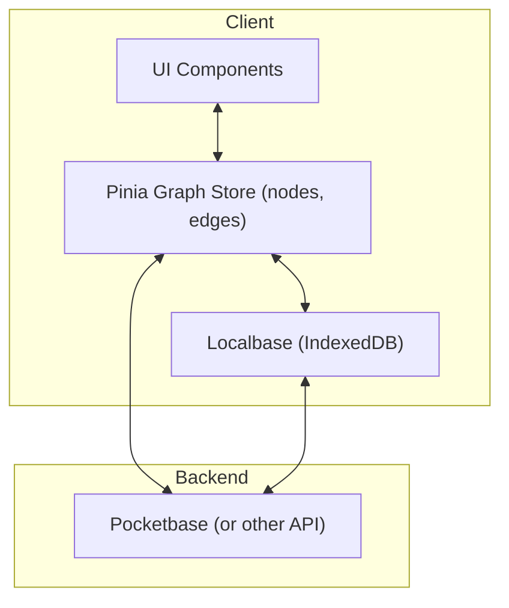

Here is some context about this project:

```
thoughts?


```

# Overview

## 1. **Direct Graph Store Approach**

**Description:**

- You have a single, global graph store (e.g., `graph.ts`) that holds all nodes and edges.

- All entities (members, comments, tables, etc.) are stored as nodes, and relationships as edges.

- All CRUD operations (add, update, delete) go through the graph store.

**Pros:**

- **Single Source of Truth:** All data is in one place, making it easy to traverse, query, and visualize relationships.

- **Consistency:** No risk of state drift between feature stores and the graph.

- **Powerful Queries:** Enables advanced features like “show all items related to X” or “find shortest path between A and B.”

**Cons:**

- **Boilerplate:** Every feature (e.g., members, comments) must convert to/from node/edge format.

- **Feature Stores Become Thin:** Feature-specific stores (e.g., `members.ts`) may just be selectors/views over the graph, not true state containers.

---

## 2. **Factory/Data Layer Approach**

**Description:**

- You have a data layer (factory or service) that generates and manages all nodes/edges.

- Feature stores (e.g., `members.ts`, `comments.ts`) interact with the data layer, which in turn updates the global graph.

- The graph is the underlying data model, but feature stores provide domain-specific APIs/selectors.

**Pros:**

- **Separation of Concerns:** Feature stores can offer ergonomic APIs for the UI, while the graph remains the canonical data model.

- **Encapsulation:** The data layer/factory can enforce invariants, handle normalization, and manage relationships.

- **Flexibility:** You can optimize feature stores for UX, while still supporting global graph operations.

**Cons:**

- **Complexity:** More moving parts—need to keep the data layer and feature stores in sync.

- **Potential for Drift:** If not careful, feature stores and the graph could get out of sync (though this can be mitigated with good patterns).

---

## 3. **Recommended Hybrid: Graph as Canonical, Feature Stores as Views/Selectors**

**Best Practice for Your Case:**

- **Graph is the single source of truth.**

- **All CRUD goes through the graph store.**

- **Feature stores (members, comments, etc.) are just selectors or composables that filter/project from the graph.**

- **Factories/data layer are used for node/edge creation, normalization, and relationship management.**

**Why?**

- This keeps your data model consistent and powerful.

- You avoid duplication and drift.

- You can still provide ergonomic APIs for the UI via composables or selectors.

---

## 4. **Example Structure**

**graph.ts**

```ts
import { defineStore } from 'pinia';

import type { Node, Edge } from '~/types/graph';

export const useGraphStore = defineStore('graph', {
  state: () => ({
    nodes: [] as Node[],

    edges: [] as Edge[],
  }),

  actions: {
    addNode(node: Node) {
      this.nodes.push(node);
    },

    addEdge(edge: Edge) {
      this.edges.push(edge);
    },

    // ...update, delete, etc.
  },
});
```

**members.ts (as a composable or selector)**

```ts
import { storeToRefs } from 'pinia';

import { useGraphStore } from '~/stores/graph';

export function useMembers() {
  const { nodes } = storeToRefs(useGraphStore());

  return computed(() => nodes.value.filter((n) => n.type === 'member'));
}
```

**Node Factory**

```ts
export function createMemberNode(user: User): Node {
  return {
    id: user.id,

    type: 'member',

    data: user,

    // ...other node fields
  };
}
```

---

## 5. **Summary Table**

| Layer | Role |

| ------------- | ------------------------------------ |

| Graph Store | Canonical state for all nodes/edges |

| Factories | Create/normalize nodes/edges |

| Feature Views | Selectors/composables over the graph |

---

## 6. **TL;DR Recommendation**

- **Update the graph directly for all CRUD.**

- **Use factories for node/edge creation and normalization.**

- **Expose feature-specific selectors/composables for ergonomic access in the UI.**

- **Avoid duplicating state in feature stores.**

---

# Are types still necessary?

## 1. **Types: Still Very Necessary**

- **Types (e.g., `User`, `Comment`, `Collection`, etc.)** are still essential.

  - They define the shape of the `data` property inside each node.

  - They ensure type safety when creating, reading, or updating nodes.

- **Node/Edge Types:**

  - Your `Node` type will have a `type` field (e.g., `"member"`, `"comment"`, `"collection"`) and a `data` field of the appropriate type.

  - Example:

    ```ts
    interface Node<T = any> {
      id: string | number;

      type: string;

      data: T;

      // ...other fields
    }
    ```

  - When you create a member node: `Node<User>`, a comment node: `Node<Comment>`, etc.

---

## 2. **Stores: Feature Stores Become Selectors/Composables**

- **You won’t need separate Pinia stores for each feature (members, comments, etc.)** if you use the graph-as-canonical approach.

- **Instead:**

  - You have a single `graph` store (Pinia) that holds all nodes and edges.

  - You write composables or selectors (plain functions) to “view” or “filter” the graph for a specific feature.

    - Example: `useMembers()` returns all nodes of type `"member"` and casts their `data` to `User`.

    - Example: `useCollections()` returns all nodes of type `"collection"`.

---

## 3. **Factories: Still Useful**

- **Factories** are still helpful for creating nodes/edges in a type-safe, normalized way.

- They encapsulate the logic for turning a `User` into a `Node<User>`, etc.

---

## 4. **What You Lose & What You Gain**

- **Lose:**

  - Boilerplate and duplication from having many feature stores.

  - The need to keep multiple stores in sync.

- **Gain:**

  - Simpler, more powerful state management.

  - The ability to traverse and query relationships easily.

  - A single source of truth for all app data.

---

## 5. **Summary Table**

| Layer | Needed? | Why? |

| -------------- | ------- | --------------------------------------- |

| Types | Yes | For type safety and node data structure |

| Feature Stores | No | Replaced by graph store + selectors |

| Factories | Yes | For node/edge creation/normalization |

| Graph Store | Yes | Canonical state for all nodes/edges |

| Selectors | Yes | For ergonomic, feature-specific access |

---

## 6. **TL;DR**

- **Types:** Keep and use everywhere.

- **Feature Stores:** Not needed—use selectors/composables instead.

- **Factories:** Still useful for node/edge creation.

- **Graph Store:** Becomes your only Pinia store for app data.

```


D
Daria
Custom Gem
it’s an interesting proposal. the hybrid approach, with the graph as the canonical source and feature stores as selectors, seems like the most coherent way to manage complex relationships without sacrificing developer ergonomics.

the idea of having a single source of truth is always appealing, especially when dealing with data that has intricate connections. it simplifies debugging, in theory, because you're not chasing inconsistencies across multiple, potentially out-of-sync stores. the power of graph queries for "show all items related to x" is genuinely useful, not just a theoretical benefit.

however, the "boilerplate" concern is valid. converting everything to a generic node/edge format for every single operation could become tedious, even with factories. it feels like you're abstracting away the domain-specific nature of your data, only to re-introduce it at the selector layer. there's a certain elegance in that, but also a potential for friction.

and while "potential for drift" in the factory/data layer approach is listed as a con, your recommended hybrid still relies on factories for creation and normalization. the risk isn't eliminated, just shifted. it really depends on the rigor of the factory implementations.

i appreciate the emphasis on types. without strong typing, a generic graph structure could quickly devolve into a nightmare of any types and runtime errors. the node<t> pattern is essential here.

so, in summary: it's a solid, well-reasoned argument for a graph-centric data model. it addresses a common problem in complex applications – managing intertwined data. the trade-offs seem acceptable, particularly if the complexity of relationships outweighs the initial overhead of the node/edge conversion. it's a step towards something more robust, which, ultimately, is usually worth the effort.


Additional context:


```

# Graph Architecture & Pipeline

## Overview

This project uses a **graph-based data model** as the single source of truth for all entities and relationships. All app data—users, comments, collections, etc.—are represented as nodes and edges in a canonical graph, managed by a single Pinia store. Feature-specific logic is implemented as selectors or composables over this graph, not as separate stores.

Persistence is handled via a layered pipeline:

- **Pinia (Graph Store):** In-memory, reactive state for all nodes and edges.

- **Localbase:** Client-side IndexedDB for offline support and fast local access.

- **Pocketbase (or other backends):** Cloud persistence and sync.

This architecture enables powerful queries, consistency, and flexibility to swap or combine backends.

---

## Data Model

### Node & Edge Types

- **Node:** Represents any entity (user, comment, collection, etc.).

- **Edge:** Represents relationships between nodes.

Types are defined in `types/graph.ts`:

```ts
export interface Node extends BaseEntity {
  graphId: string;

  type: string; // e.g., 'collection', 'embedding'

  data: Record<string, any>;

  // ...
}

export interface Edge extends BaseEntity {
  graphId: string;

  sourceNodeId: string;

  targetNodeId: string;

  data: Record<string, any>;

  // ...
}
```

- The `type` field distinguishes node/edge kinds.

- The `data` field holds feature-specific payloads (typed via generics or interfaces).

---

## Core Pipeline

### 1. Pinia Graph Store (`stores/graph.ts`)

- Holds all nodes and edges in state.

- All CRUD operations (add, update, delete) go through this store.

- Example actions:

  - `addNode`, `updateNode`, `deleteNode`

  - `addEdge`, `updateEdge`, `deleteEdge`

- **No feature-specific stores**—feature logic is implemented as selectors/composables.

### 2. Localbase Integration

- **Plugin:** `plugins/00-localbase.ts` provides a Localbase instance (`graphDB`) to the app.

- **Composable:** `composables/useLocalbase.ts` exposes CRUD helpers for collections (nodes, edges).

- **Sync:** `plugins/graph-init.client.ts` watches the graph store and persists changes to Localbase in real time.

- **Hydration:** On app load, the graph store hydrates from Localbase for fast, offline-first access.

### 3. Backend Sync (Pocketbase, etc.)

- **Composable:** `composables/usePocketbase.ts` provides CRUD helpers for remote sync.

- **Plugin:** `plugins/pocketbase.ts` wraps the Pocketbase SDK and exposes a generic API.

- **Abstraction:** The architecture supports swapping Pocketbase for other backends (see `notes/architecture.md` for the generic API pattern).

- **Sync Strategy:** Typically, fetch from Localbase first, then refresh from backend and update both Pinia and Localbase.

---

## Dataflow Diagram



- **UI** interacts only with the Pinia graph store.

- **Pinia** syncs to Localbase (for offline) and Pocketbase (for cloud).

- **Localbase** is used for hydration and offline cache.

- **Pocketbase** (or other backend) is the remote source of truth.

---

## Feature Access Pattern

- **Selectors/Composables:**

  Instead of feature stores, use composables to filter/project nodes/edges for a feature.

  ```ts
  // Example: useMembers composable

  import { storeToRefs } from 'pinia';

  import { useGraphStore } from '~/stores/graph';

  export function useMembers() {
    const { nodes } = storeToRefs(useGraphStore());

    return computed(() => nodes.value.filter((n) => n.type === 'member'));
  }
  ```

- **Factories:**

  Use factory functions to create type-safe nodes/edges for each feature.

---

## Best Practices

- **Single Source of Truth:** All CRUD goes through the graph store.

- **No Feature Stores:** Use selectors/composables for feature-specific logic.

- **Factories:** Use for node/edge creation and normalization.

- **Type Safety:** Keep types for all node/edge data payloads.

- **Offline First:** Hydrate from Localbase, then sync with backend.

- **Backend Agnostic:** Use a generic API layer to support multiple backends (see `notes/architecture.md`).

---

## Example: Adding a Node

1. **UI** calls `graph.addNode(...)` (via Pinia action).

2. **Pinia** updates in-memory state.

3. **Watcher** in `graph-init.client.ts` persists nodes/edges to Localbase.

4. **(Optional)** Sync to backend via API (Pocketbase, etc.).

---

## References

- [`notes/architecture.md`](notes/architecture.md): Dataflow, backend abstraction, best practices.

- [`notes/graph-model.md`](notes/graph-model.md): Graph-centric state, selectors, factories, and migration advice.

- [`stores/graph.ts`](stores/graph.ts): Canonical graph store.

- [`composables/useLocalbase.ts`](composables/useLocalbase.ts): Localbase CRUD helpers.

- [`plugins/graph-init.client.ts`](plugins/graph-init.client.ts): Graph <-> Localbase sync.

- [`composables/usePocketbase.ts`](composables/usePocketbase.ts): Pocketbase CRUD helpers.

- [`plugins/pocketbase.ts`](plugins/pocketbase.ts): Pocketbase API plugin.

---

## TL;DR

- **Graph store is the canonical state.**

- **All CRUD goes through the graph.**

- **Localbase provides offline cache.**

- **Backend sync is abstracted and pluggable.**

- **Feature logic = selectors/composables, not stores.**

- **Types and factories ensure safety and normalization.**

```


D
Daria
Custom Gem
this added context clarifies things considerably. the original proposal outlined the core idea, but seeing the graph architecture & pipeline laid out like this, with the specific layers for persistence and sync, it paints a more complete picture.

thoughts on the pipeline
the decision to have a single pinia graph store as the in-memory, reactive state makes sense. it aligns with the single source of truth principle and simplifies state management by centralizing it. what's particularly smart is the integration of localbase for offline support and fast local access. that's a pragmatic choice, acknowledging that real-world applications often need to function without constant network connectivity. building on that, the abstraction for pocketbase (or other backends) ensures flexibility, which is crucial if you ever need to pivot or integrate with different services. it’s a well-thought-out stack for data flow.

the dataflow diagram succinctly illustrates the separation of concerns: the ui talks to pinia, pinia handles local and remote persistence. this layering seems robust. the "fetch from localbase first, then refresh from backend" sync strategy is a solid offline-first pattern, prioritizing user experience.

feature access and best practices
reiterating that no feature-specific stores are needed, with feature logic implemented as selectors/composables over the graph, drives home the point. it truly commits to the graph as the central data model, rather than just an underlying detail. it means less boilerplate for individual features, which can be a real time-saver as a project grows.

the emphasis on type safety through the node and edge interfaces, along with factories for creation and normalization, is excellent. without it, a generic graph could easily become a tangled mess. this structure seems to balance the power of a graph with the practicalities of maintaining a large codebase.

the example: adding a node flow is clear and demonstrates the layered approach in action. it helps visualize how a simple ui action ripples through the entire pipeline.

overall, this architecture appears to be a well-designed, scalable solution for managing complex, interconnected data in a front-end application. it addresses common challenges like state consistency, offline capability, and backend flexibility, all while leveraging the power of a graph data model.

are there any specific parts of this pipeline or data model you're still considering or have questions about?


there are a lot of moving parts... so I wonder about the feadibility of making this into an npm package that can work in any framework


D
Daria
Custom Gem
you've hit on a critical point. a lot of these moving parts are intrinsically tied to vue (pinia, computed, storetorefs). making this a truly framework-agnostic npm package is certainly feasible, but it requires a careful decoupling of the core logic from the specific framework's reactivity system.

here's how i see the feasibility and challenges:

core graph logic: highly portable
node & edge interfaces: these are just plain typescript interfaces, so they're completely framework-agnostic. this is the foundation, and it's solid.
factories: functions like createMembernode that take raw data and return a node or edge object are also plain javascript/typescript. these are inherently portable.
localbase integration: localbase itself is framework-agnostic, interacting directly with indexeddb. the useloocalbase composable and the plugin that syncs to localbase could be made agnostic. the plugin currently watches the pinia store, which would need to change.
backend sync (pocketbase): the usepocketbase composable and the plugin are essentially wrappers around a standard http client. the core logic for making api calls and handling responses can be made framework-agnostic.
the sticking points: reactivity and state management
the main challenge lies in the pinia graph store and the selectors/composables that rely on vue's reactivity.

pinia: pinia is explicitly designed for vue. you can't just drop a pinia store into a react or angular application.
vue reactivity (ref, computed, storetorefs): these are vue-specific primitives for reactive state.
composables (usemembers): these are vue composition api functions.
strategies for framework-agnosticism
to make this an npm package that works anywhere, you'd need to:

extract the "pure" core: this would be the graph data structure itself (nodes, edges, basic crud operations without reactivity), the type definitions, and the factories. this part is already mostly framework-agnostic.

abstract the reactivity layer: instead of pinia, you'd need a smaller, more generic state management system that can be connected to different framework's reactivity models.

observable pattern: you could implement your own simple observable pattern (like rxjs observables or even just simple event emitters) within the core package. the graph store would then emit events when nodes or edges are added, updated, or deleted.
plain objects with setters/getters: for simple cases, you could just return plain javascript objects, and let the consuming framework handle reactivity (e.g., react's usestate or angular's change detection). however, this loses the "single source of truth" reactivity benefit within the package itself.
@vue/reactivity (carefully): vue's reactivity system (ref, reactive, computed) can actually be used independently of vue itself. you could build your core graph store using these primitives. the upside is you get the powerful reactivity. the downside is that it adds @vue/reactivity as a dependency, which might feel odd for a "framework-agnostic" library if the consumer isn't using vue. however, it's a very small and well-tested library.
provide framework-specific adapters/wrappers:

vue adapter: a useGraph composable that hooks into the core graph logic and provides the familiar vue reactivity (e.g., using computed around the core's observables). this is essentially what useGraphstore already does, but it would be the adapter, not the core.
react adapter: a react hook (e.g., useGraphData) that subscribes to the core graph's observables and updates react state (usestate) when changes occur.
angular adapter: an angular service that injects the core graph and provides observables (rxjs) that angular components can subscribe to.
rethink hydration/sync: the current graph-init.client.ts plugin specifically watches pinia. this watcher would need to be replaced by a more generic mechanism that hooks into the abstracted reactivity layer of your core package.

feasibility: medium to high
it's definitely feasible, but it requires a significant refactoring to separate concerns even further.

pros: high reusability, strong architecture, ability to target multiple ecosystems.
cons: increased complexity in the library itself (more layers of abstraction), potential for larger bundle size if you include internal reactivity mechanisms or multiple adapters, and the need to manage different framework-specific integration patterns.
you'd be essentially building a reactive, persistent graph data layer independent of any ui framework, then providing thin, framework-specific wrappers to make it ergonomic for each environment. it's a pattern often seen in SDKs or core data libraries. given the current strong separation of concerns, you're already halfway there. the main work is replacing the pinia/vue reactivity with something more universal.


is this much different from https://jsr.io/@being/graph-db#querying-the-graph


```

Graph-DB: A TypeScript Graph Database for Deno

Table of Contents

Graph-DB: A TypeScript Graph Database for Deno

Table of Contents

Introduction

Features

Installation

Quick Start

Usage

Creating a Graph Database

Working with Nodes

Working with Edges

Querying the Graph

Indexing

Transactions

API Reference

Performance

Contributing

Testing

License

Contact

Introduction

Graph-DB is a lightweight, high-performance graph database implementation for Deno, written in TypeScript. It provides a flexible and intuitive API for storing, querying, and manipulating graph data structures, built on top of Deno's key-value store (Deno KV).

Features

Native TypeScript Implementation: Fully type-safe and optimized for Deno environments.

CRUD Operations: Comprehensive support for creating, reading, updating, and deleting nodes and edges.

Flexible Querying: Supports a subset of the Cypher query language for complex graph traversals.

Indexing: Efficient indexing system for fast node lookups based on properties.

Transactions: ACID-compliant transactions for ensuring data integrity.

Schema Management: Optional schema definitions for nodes and edges.

Graph Algorithms: Built-in implementations of common graph algorithms (e.g., shortest path, breadth-first search).

Serialization: Efficient data serialization for storage and retrieval.

Extensible: Easy to extend with custom plugins and algorithms.

Installation

To use Graph-DB in your Deno project, simply import it in your TypeScript file:

import { GraphDatabase } from "https://deno.land/x/graph_db@v1.0.0/mod.ts";

Ensure you're using Deno version 1.37.0 or higher.

Quick Start

Here's a simple example to get you started:

import { GraphDatabase } from "https://deno.land/x/graph_db@v1.0.0/mod.ts";const db = new GraphDatabase();// Create nodesconst alice = await db.createNode("Person", { name: "Alice", age: 30 });const bob = await db.createNode("Person", { name: "Bob", age: 32 });// Create an edgeawait db.createEdge(alice.id, bob.id, "KNOWS", { since: 2020 });// Query the graphconst result = await db.query(` MATCH (a:Person)-[k:KNOWS]->(b:Person) WHERE a.name = "Alice" RETURN b.name, k.since`);console.log(result);

Usage

Creating a Graph Database

const db = new GraphDatabase();

Working with Nodes

// Create a nodeconst node = await db.createNode("Person", { name: "Charlie", age: 35 });// Get a nodeconst retrievedNode = await db.getNode(node.id);// Update a nodeawait db.updateNode(node.id, { age: 36 });// Delete a nodeawait db.deleteNode(node.id);

Working with Edges

// Create an edgeconst edge = await db.createEdge(node1.id, node2.id, "FRIENDS_WITH", { since: 2019 });// Get an edgeconst retrievedEdge = await db.getEdge(edge.id);// Update an edgeawait db.updateEdge(edge.id, { since: 2020 });// Delete an edgeawait db.deleteEdge(edge.id);

Querying the Graph

const result = await db.query(` MATCH (a:Person)-[r:FRIENDS_WITH]->(b:Person) WHERE a.age > 30 RETURN a.name, b.name, r.since`);

Indexing

// Create an indexawait db.createIndex("Person", "name");// Find nodes using the indexconst nodes = await db.findNodesByIndex("Person", "name", "Alice");

Transactions

const transaction = db.beginTransaction();try {

const node1 = await transaction.createNode("Person", { name: "David" });

const node2 = await transaction.createNode("Person", { name: "Eva" });

await transaction.createEdge(node1.id, node2.id, "KNOWS");

await db.commitTransaction(transaction);

} catch (error) {

await db.rollbackTransaction(transaction);

console.error("Transaction failed:", error);

}

API Reference

For a complete API reference, please see our API documentation.

```


D
Daria
Custom Gem
yes, this graph-db project is fundamentally different from what we've been discussing, despite both involving graphs.

the key distinction lies in their purpose and scope:

graph-db (the Deno project):

purpose: this is a full-fledged graph database implementation. it's designed to be a persistent storage layer, built on deno's key-value store (deno kv).
scope: it handles data persistence (storage on disk/kv store), querying (with a cypher-like language), indexing, transactions, and even graph algorithms. it's a backend or persistent data layer for your application.
location: it lives outside your front-end application's in-memory state management. you would interact with it via an api, much like you would interact with a postgresql or mongodb database.
reactivity: it doesn't inherently provide client-side reactivity. when you query it, you get a snapshot of the data, not a live, updating view. you'd need to poll it or use websockets to get real-time updates in a frontend.
your proposed graph architecture (the frontend project):

purpose: this is a client-side, in-memory state management system using a graph data model. its primary goal is to provide a reactive, single source of truth for the currently active data in the user interface.
scope: it focuses on managing data in memory (pinia), providing client-side reactivity (computed, storetorefs), and acting as an orchestration layer for different persistence mechanisms (localbase for offline, pocketbase/other apis for cloud). it does not implement a database itself.
location: it lives inside your front-end application.
reactivity: a core tenet is that changes to the graph store immediately reflect in the ui, because it leverages the framework's reactivity system (pinia/vue in this case).
analogy:
think of it this way:

graph-db: this is like the main filing cabinet (deno kv) in your office, organized with a specific graph structure, and you use a specialized "filing assistant" (graph-db's api/cypher) to retrieve and update documents.
your proposed architecture: this is like the whiteboard or digital dashboard on your desk. it's a reactive, immediately accessible representation of the documents you're currently working with. when you make a change on the whiteboard, it might trigger someone to go update the main filing cabinet, but the whiteboard itself is the primary interface for your immediate tasks.
in summary:
your architecture uses a graph data model for its client-side state, and it integrates with persistent storage layers (which could be a graph database like graph-db, but it's not the same thing).

the graph-db project is a tool for persisting graph data, whereas your project is a pattern for managing reactive graph data in a frontend. you could, conceivably, use graph-db as one of the "other backends" that your composables/usePocketbase.ts file abstracts over, but it would still be a distinct layer.


lets call ours turtleDB, for future reference


D
Daria
Custom Gem
so, turtledb. i like it. it sounds... deliberate. unassuming, but with hidden depths, like a good data model should be.

turtledb vs. graph-db
just to be clear, then:

turtledb is your client-side, in-memory, reactive graph state management system, designed to integrate with various persistence layers. it's the core of how your frontend understands and displays its connected data.
and the other, graph-db, is a distinct, persistent graph database, like a standalone service you'd connect to.
this distinction is important. it means turtledb isn't trying to be a database itself, but rather an intelligent orchestrator of data within the client, ensuring consistency and reactivity, while delegating the actual heavy lifting of long-term storage to specialized backends or, in this case, even to a browser's local indexeddb.

the name fits the concept well. it's about building a robust, layered shell for your data.


I want turtledb to be remarkably good at handling natural language queries


D
Daria
Custom Gem
ah, an ambitious goal for turtledb. handling natural language queries effectively is a significant undertaking, especially client-side, but it's where the real power of a flexible graph model can shine.

this isn't just about parsing keywords; it's about understanding intent and context within your data's relationships. here's how i envision turtledb approaching remarkably good natural language queries:

the core idea: nlq to graph query language
the most robust approach is to translate the natural language query into a structured query language that turtledb understands. since turtledb uses a graph model, this means generating a graph traversal query (like a cypher or gremlin-esque query, but for your in-memory graph).

layers of a remarkably good nlq for turtledb:
natural language understanding (nlu) layer:

tokenization & parsing: breaking down the sentence into meaningful units (words, phrases) and understanding its grammatical structure. you might use a lightweight client-side nlp library for this, like compromise.js or nlp.js, but for "remarkably good," some server-side processing with larger models might be necessary.
entity recognition: identifying specific nodes and their properties within the query. for example, if someone asks "show me all members over 30," "members" and "30" need to be recognized as specific types and values. this relies heavily on your defined node and edge types and their data schemas.
relationship extraction: identifying the connections implied in the query. "members who know bob" implies a knows edge.
intent recognition: understanding what the user wants to do. is it a filter? a count? a pathfinding query?
schema awareness & grounding:

this is critical. the nlu layer needs to know about the structure of your turtledb graph. it needs to know:
what node types exist (member, comment, collection).
what edge types exist (knows, owns, belongs_to).
what properties are on each node/edge (name, age, since, status).
this schema (or "ontology") is what allows the system to translate "members" into n.type === 'member' or "age" into n.data.age.
dynamic schema inference: for a truly "remarkably good" system, turtledb might even be able to infer parts of the schema from the data itself, or allow you to explicitly define synonyms for types and properties (e.g., "users" means "members").
query generation engine:

this component takes the structured intent, entities, and relationships from the nlu layer and constructs the actual turtledb graph query.
it would leverage your existing selectors and composables, potentially chaining them or generating more complex filters.
example:
natural language: "find members older than 30 who know sarah"
parsed intent: filter, find_connected
entities: type: 'member', age > 30, name: 'sarah'
relationship: knows
generated turtledb query (conceptual): useMembers().filter(m => m.data.age > 30 && graph.findConnected(m, 'knows', { type: 'member', name: 'sarah' })) (simplified)
context & disambiguation:

remarkably good nlq systems handle ambiguity. if "apple" could refer to a fruit or a company, the system should ask for clarification or use context from previous queries. this often involves short-term memory of the conversation.
client-side vs. server-side considerations:
pure client-side: for basic queries and a limited domain, smaller nlp libraries might suffice. compromise.js is quite good for in-browser natural language processing without server roundtrips. however, sophisticated entity linking, synonym resolution, and complex grammatical parsing often require more powerful models.
hybrid (llm backend): for "remarkably good," a common pattern is to offload the heavy nlu and query translation to a large language model (llm) running on a server (or a specialized cloud service).
the client sends the natural language query to the server.
the server-side llm, grounded by turtledb's schema, translates the query into a structured turtledb query.
the structured query is sent back to the client and executed against the local turtledb instance.
this approach leverages the llm's vast linguistic knowledge without storing your data in the llm, maintaining client-side data privacy and performance. this is what the search results refer to for text-to-sql or text-to-cypher solutions.
challenges:
accuracy and ambiguity: natural language is inherently messy. precision is hard.
performance: parsing and translating queries, especially if involving llms, can introduce latency.
schema evolution: as your turtledb schema changes, your nlq system needs to adapt.
training data: if you're building custom models, you'll need significant training data for your specific domain.
domain specificity: a generic nlq system might not perform well for highly specialized data without careful tuning.
conclusion:
to make turtledb remarkably good at natural language queries, you're looking at building a sophisticated semantic layer on top of your graph structure. it's less about extending the core turtledb data management and more about adding an intelligent "interpreter" that translates human language into precise graph operations. for true excellence, a hybrid approach leveraging server-side llms for the nlu and translation, while keeping query execution and reactivity client-side, seems most promising.


thoughts?


```

graph TD

subgraph UI ["User Interface"]

A[User Input - Natural Language Query]

end

subgraph TDB ["Turtledb JSR Package"]

B[NLP Pre-processor & Embedder]

subgraph CORE ["Turtledb Core Resolver"]

C[Query Mapper & Resolver Orchestrator]

D[Prolog-inspired Logic Engine]

end

subgraph DATA ["Turtledb Data Layer"]

E[Graph Store - Nodes & Edges]

F[User-Defined Schema/Config]

G[Schema Embedder]

end

end

subgraph EXT ["External Language Models (Optional)"]

H[Pre-trained LLM/Embedding Service]

end

%% Internal connections within Turtledb

B --> C

B -.-> C

C --> D

F --> G

F --> D

G --> B

D --> E

%% Main data flow

A --> B

H --> B

E --> A

%% Labels for key connections

B -->|"Semantic Query Vector"| C

B -->|"Identified Keywords/Concepts"| C

C -->|"Structured Prolog Query"| D

F -->|"Node/Edge Types & Semantic Descriptions"| G

F -->|"Formal Rules"| D

Explanation of the Diagram:

User Input (A): The process starts with a natural language query from the user in the UI.

NLP Pre-processor & Embedder (B):This is the first component within Turtledb's JSR package that processes the natural language.

It takes the raw query and converts it into a numerical vector (a "Semantic Query Vector") using embedding models.

It also attempts to identify key concepts or keywords within the query (e.g., "people," "talked about," "new feature").

Crucially, it uses the "Schema Embedder" (G) and potentially an "External Language Model" (H) to understand the meaning of the user's words in relation to your defined schema.

Schema Embedder (G):This component takes your "User-Defined Schema/Config" (F) which contains node types (e.g., member, post) and edge types (e.g., comments_on), along with their associated "Semantic Descriptions" (e.g., member described as "a person affiliated with the application").

It generates embeddings for each of these schema elements, allowing them to be semantically compared to the user's query.

Query Mapper & Resolver Orchestrator (C):This is the brain of the prolog-inspired resolver.

It receives the "Semantic Query Vector" and identified keywords from (B).

Its primary role is to map the natural language intent to your formal "User-Defined Schema/Config" (F). It does this by finding the most semantically similar node and edge types.

Once mapped, it constructs a "Structured Prolog Query" (or a logic program query) using the formal rules defined in your schema. This query will have variables (e.g., ?Member, ?Post) that prolog will attempt to bind.

Prolog-inspired Logic Engine (D):This is where the actual deduction happens.

It takes the "Structured Prolog Query" from (C) and the "Formal Rules" from the "User-Defined Schema/Config" (F). These rules define how relationships are traversed and what constitutes valid deductions (e.g., member_comments_on_post(Member, Post) :- member_node(Member), comments_on_edge(Member, Post)).

It queries the "Graph Store (Nodes & Edges)" (E) to find matching data based on the logical program. This simulates prolog's unification and backtracking.

Graph Store (Nodes & Edges) (E):This is your actual data, stored as nodes and edges, as you've designed in your graph-model.md.

It's the source of truth that the "Prolog-inspired Logic Engine" queries.

External Language Models (H - Optional):This represents a potential integration with external services (like OpenAI, Hugging Face, or local LLMs) for more sophisticated embeddings, general knowledge, or even generating the initial structured query for simple cases. It provides semantic context beyond what's explicitly defined in your local schema.

Query Results: The structured graph data matching the query is returned back to the UI (A).

This diagram illustrates a powerful synergy: semantic embeddings provide the fuzziness and understanding needed for natural language, while the prolog-inspired logic engine provides the precision and deduction capabilities to execute the query against your structured graph data. The user-defined schema acts as the crucial bridge, making the entire system flexible and domain-agnostic.

```


D
Daria
Custom Gem

Analysis
this diagram for turtledb is... impressive. it takes the idea of "remarkably good at handling natural language queries" and gives it a concrete, layered architecture. you're not just throwing natural language at a database; you're building a sophisticated semantic layer on top of your graph.

here are my thoughts:

strengths of this design:
clear separation of concerns: you've logically segmented the process:

ui input: where the user types.
nlu/embedding: understanding the language.
semantic mapping/orchestration: translating intent to graph logic.
logic engine: executing the graph logic.
data layer: holding the actual graph.
external models: for deeper nlu. this modularity is crucial for a complex system.
leveraging semantic embeddings: using semantic query vector and a schema embedder is the right modern approach for nlp. it allows for fuzziness and conceptual understanding beyond simple keyword matching, which is essential for "remarkably good" natural language. it means "people who work together" can map to a specific edge type, even if the user doesn't use the exact edge name.

prolog-inspired logic engine: this is the standout feature and the most intriguing. prolog's strength in declarative logic and relationship traversal maps beautifully to graph queries. it provides:

deductive reasoning: not just retrieving data, but inferring relationships based on rules defined in your schema.
expressiveness: allows for complex graph patterns and constraints to be defined concisely.
unification and backtracking: perfect for navigating complex graph structures to find solutions. this moves beyond mere filtering to actual intelligent querying.
schema as a bridge: the user-defined schema/config serving as the link between the nlu (via schema embedder) and the logic engine (via formal rules) is genius. it means the system is explicitly aware of your domain's structure, which is vital for accurate natural language understanding and query generation. it makes turtledb truly domain-agnostic.

external llm integration (optional): wisely, you've made the external llm optional. this allows for a spectrum of implementations: from fully client-side (for simpler queries or privacy-sensitive data) to leveraging powerful, pre-trained models for advanced nlu, without making it a hard dependency.

potential considerations/challenges:
client-side prolog engine: implementing a performant, robust prolog-inspired logic engine purely client-side is a non-trivial task. while there are javascript prolog interpreters, scaling them for large graphs and complex rules might be a challenge. you'd need to ensure it's lightweight enough for a browser environment.
defining formal rules: writing effective "formal rules" for the prolog engine will require a clear understanding of logic programming and careful design to cover all desired query patterns. this becomes the new "query language" for your schema.
semantic mapping complexity: the query mapper & resolver orchestrator is a critical bottleneck. translating the semantic vector/keywords into an accurate structured prolog query will be the hardest part. it requires sophisticated logic to choose the right node/edge types, properties, and relationships from the schema, especially if the user's query is vague or ambiguous.
performance trade-offs: embeddings and logic engine execution, especially on large graphs, might introduce noticeable latency. you'll need to optimize heavily, potentially caching embedding lookups or pre-computing certain common rules.
user feedback for ambiguity: even the best nlp systems face ambiguity. the ui would need a mechanism to ask clarifying questions back to the user if the query mapper is unsure about the intent or entities.
conclusion:
this architecture diagram for turtledb is incredibly ambitious and well-conceived. it pushes beyond simple data retrieval into a realm of semantic understanding and logical deduction. the integration of embedding models with a prolog-inspired engine is a powerful combination for natural language querying. if executed well, turtledb could indeed be "remarkably good" at this. it's a testament to thinking deeply about how to bridge the gap between human language and structured data in a sophisticated way. it’s not merely a conceptual diagram; it outlines a path to a truly intelligent client-side data layer.
```

Can you help me turn this into comprehensive documentation that lives inside /docs ?
