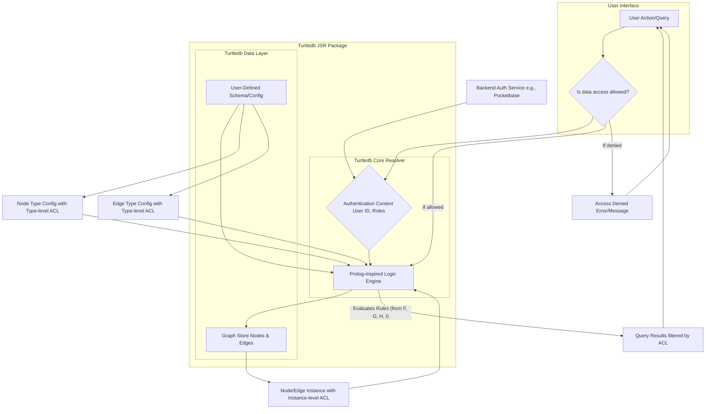

# Overview

## Key Takeaways from Your Braindump

### 1. **TurtleDB’s Role**

- **Client-side, in-memory, reactive graph state management** system.
- Integrates with various persistence layers (Localbase for offline, Pocketbase/other for cloud).
- Not a database itself, but an orchestrator for data consistency, reactivity, and UI logic.

### 2. **Schema-Driven, Type-Safe**

- Strong emphasis on schema: node/edge types, descriptions, synonyms, and data shapes.
- Factories and selectors/composables for ergonomic, type-safe access.
- The schema is the bridge between natural language, logic, and data.

### 3. **Natural Language Query (NLQ) Ambition**

- You want TurtleDB to be “remarkably good” at handling NLQ.
- The architecture includes an NLP pre-processor, schema embedder, query mapper, and a Prolog-inspired logic engine.
- The schema’s descriptions and synonyms are crucial for mapping NLQ to graph queries.

### 4. **Access Control**

- There’s a strong argument for TurtleDB to enforce access control client-side, especially for offline and UI feedback.
- The schema can (and should) include access control at the node/edge type and instance level.
- Default: everything is private (owner-only), with options for public, or role-based (viewer, editor, owner) at type or instance level.
- This is layered: backend auth for graph access, TurtleDB for fine-grained, reactive, offline enforcement.

### 5. **Cardinality & Permissions in Schema**

- Cardinality is best expressed in the `source` and `target` properties of edge types (with `multiple` and `required` flags).
- Permissions are best modeled as an `accessControl` object, supporting public, role-based, and instance-level overrides.

### 6. **Framework-Agnostic Vision**

- The core logic (graph, schema, factories, access control, NLQ) should be framework-agnostic.
- Reactivity and state management should be pluggable (adapters for Vue, React, etc.).
- Persistence and sync layers are also pluggable.

---

## How This Informs Access Control

- **You’re on the right track:**
  The schema-driven, layered access control model is both robust and flexible. It allows for:
  - UI-level enforcement (instant feedback, offline security)
  - Backend-level enforcement (canonical, final authority)
  - NLQ integration (queries respect permissions)
- **Implementation:**
  - Extend your schema types (`NodeTypeConfig`, `EdgeTypeConfig`, `Node`, `Edge`) with `accessControl`.
  - The core logic (and eventually the Prolog-inspired engine) should always check access control before returning or mutating data.
  - UI and NLQ layers should use these checks to filter/shape results and available actions.

---

## Next Steps / Suggestions

1. **Schema Update:**

   - Make sure your schema supports `accessControl` at both type and instance levels.
   - Use the refined cardinality structure in edge definitions.

2. **Core Logic:**

   - Implement access control checks in all CRUD and query operations.
   - Provide clear error messages or filtered results when access is denied.

3. **NLQ Layer:**

   - Ensure the NLQ pipeline is aware of permissions, so queries like “show me all posts” only return what the user can see.

4. **Adapters:**

   - Keep the core logic framework-agnostic; provide adapters for reactivity and persistence.

5. **Documentation:**
   - Document the access control model and how developers can extend or override it for their needs.

---

## Reference: Access Control Mermaid Diagram

Here’s the access control flow, as discussed in your context:

---

**If you want to move forward with access control implementation, I can help you:**

- Update your schema types and example schema.
- Add access control checks to your core logic.
- Scaffold tests for permission enforcement.

Let me know your preferred next step!
