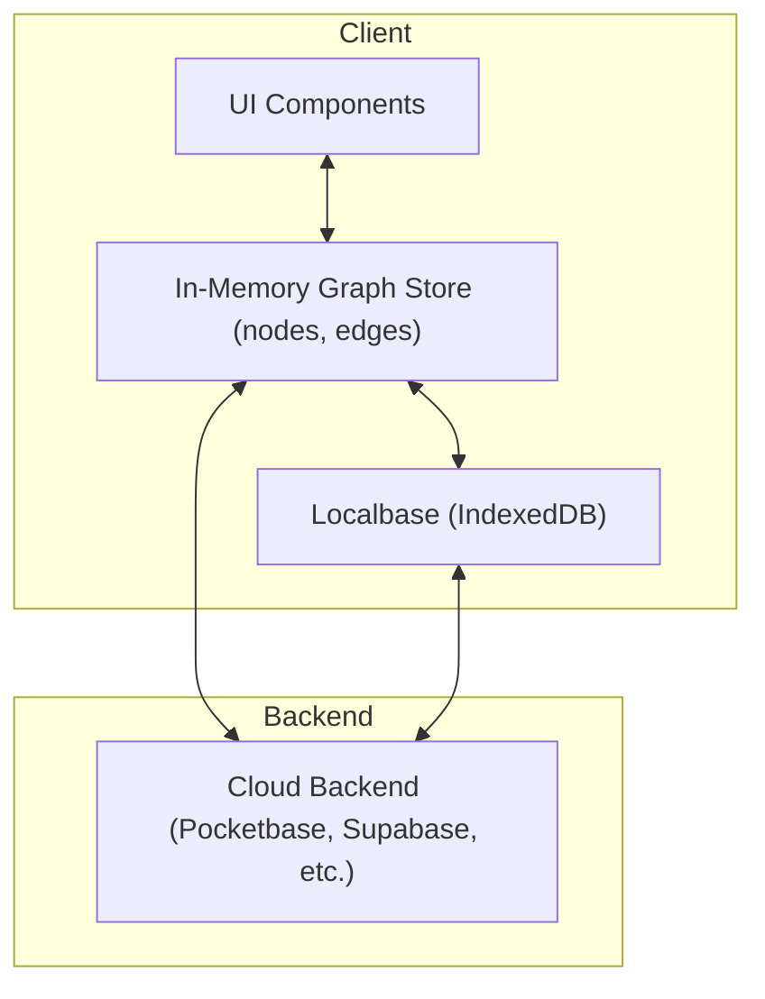

# TurtleDB Architecture

## High-Level Architecture

TurtleDB is built around a **graph-based data model** as the single source of truth for all entities and relationships. All app data—users, comments, collections, etc.—are represented as nodes and edges in a canonical graph. Feature-specific logic is implemented as selectors or composables over this graph, not as separate stores.

Persistence is handled via a layered pipeline:

- **In-Memory Graph Store:** Reactive state for all nodes and edges (framework-agnostic core, with adapters for Pinia, React, etc.).
- **Offline Cache (Localbase/IndexedDB):** Fast, local persistence for offline support and instant hydration.
- **Cloud Sync (Pocketbase, Supabase, etc.):** Pluggable backend for remote persistence and multi-device sync.

This architecture enables powerful queries, consistency, and flexibility to swap or combine backends.

---

## Data Model

### Node & Edge Types

- **Node:** Represents any entity (user, comment, collection, etc.).
- **Edge:** Represents relationships between nodes.

**Key fields:**

- `type`: Distinguishes node/edge kinds (e.g., 'member', 'comment', 'knows').
- `data`: Feature-specific payload (typed via generics or interfaces).

Example:

```ts
interface Node<T = any> {
  id: string;
  type: string;
  data: T;
  // ...other fields
}
interface Edge<T = any> {
  id: string;
  sourceNodeId: string;
  targetNodeId: string;
  type: string;
  data: T;
  // ...other fields
}
```

---

## Core Pipeline

### 1. In-Memory Graph Store

- Holds all nodes and edges in state.
- All CRUD operations (add, update, delete) go through this store.
- No feature-specific stores—feature logic is implemented as selectors/composables.

### 2. Offline Cache (Localbase/IndexedDB)

- Persists the graph locally for offline support and fast access.
- Hydrates the graph store on app load.
- Watches for changes and syncs in real time.

### 3. Cloud Sync (Pocketbase, Supabase, etc.)

- Pluggable backend for remote persistence and multi-device sync.
- Generic API layer abstracts over different backends.
- Sync strategy: fetch from local cache first, then refresh from backend and update both in-memory and local cache.

---

## Dataflow Diagram



- **UI** interacts only with the in-memory graph store.
- **Graph store** syncs to Localbase (offline) and cloud backend (remote).
- **Localbase** is used for hydration and offline cache.
- **Cloud backend** is the remote source of truth.

---

## Feature Access Pattern

- **Selectors/Composables:**
  - Instead of feature stores, use composables to filter/project nodes/edges for a feature.
  - Example: `useMembers()` returns all nodes of type 'member'.
- **Factories:**
  - Use factory functions to create type-safe nodes/edges for each feature.

---

## Best Practices

- **Single Source of Truth:** All CRUD goes through the graph store.
- **No Feature Stores:** Use selectors/composables for feature-specific logic.
- **Factories:** Use for node/edge creation and normalization.
- **Type Safety:** Keep types for all node/edge data payloads.
- **Offline First:** Hydrate from local cache, then sync with backend.
- **Backend Agnostic:** Use a generic API layer to support multiple backends.

---

## Example: Adding a Node

1. **UI** calls `graph.addNode(...)` (via adapter/composable).
2. **Graph store** updates in-memory state.
3. **Watcher** persists nodes/edges to Localbase.
4. **(Optional)** Sync to backend via API.

---

## Summary Table

| Layer         | Role                                      |
| ------------- | ----------------------------------------- |
| Graph Store   | Canonical state for all nodes/edges       |
| Factories     | Create/normalize nodes/edges              |
| Feature Views | Selectors/composables over the graph      |
| Offline Cache | Local persistence for offline/fast access |
| Cloud Sync    | Remote persistence and multi-device sync  |

---

For the NLQ pipeline and advanced querying, see [Natural Language Queries](natural-language-queries.md).
