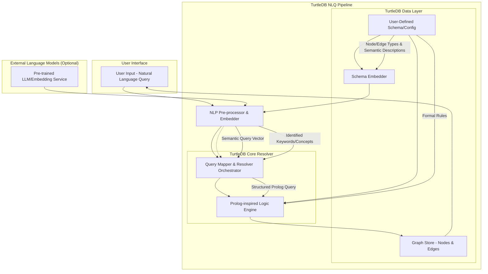

# Natural Language Queries in TurtleDB

TurtleDB is designed from the ground up to be "remarkably good" at handling natural language queries (NLQ) over your app's graph data. This is not just about keyword search—it's about understanding intent, context, and relationships, and mapping them to precise, schema-aware graph traversals.

## Vision: NLQ as a First-Class Citizen

- **Semantic Understanding:** Go beyond keywords—understand the user's intent, entities, and relationships.
- **Schema Awareness:** Leverage your explicit graph schema to ground queries in your domain.
- **Deductive Reasoning:** Use a Prolog-inspired logic engine to infer and traverse complex relationships.
- **Extensible Intelligence:** Optionally integrate with external LLMs or embedding services for deeper language understanding.

---

## NLQ Pipeline Architecture

---

## Pipeline Stages

### 1. NLP Pre-processor & Embedder

- Tokenizes and parses the user's query.
- Generates semantic embeddings (vectors) for the query and key concepts.
- Optionally leverages external LLMs or embedding APIs for richer understanding.

### 2. Schema Embedder

- Embeds your user-defined schema: node types, edge types, and their semantic descriptions.
- Enables fuzzy, concept-aware mapping between user language and your domain model.

### 3. Query Mapper & Resolver Orchestrator

- Maps the semantic query vector and identified concepts to the most relevant node/edge types and properties in your schema.
- Constructs a structured, Prolog-style logic query representing the user's intent.

### 4. Prolog-inspired Logic Engine

- Executes the structured logic query over the in-memory graph.
- Supports unification, backtracking, and deduction for expressive, multi-hop queries.
- Applies formal rules defined in your schema/config.

### 5. Graph Store (Nodes & Edges)

- The canonical, reactive graph data layer.
- All queries and traversals operate on this source of truth.

### 6. External Language Models (Optional)

- For advanced use cases, integrate with LLMs or embedding services (e.g., OpenAI, Hugging Face) to boost semantic understanding.
- All data remains local—only the query and schema are sent for embedding.

---

## Example Query Flow

1. **User:** "Find all members older than 30 who know Sarah."
2. **NLP Pre-processor:** Identifies entities (members, Sarah), properties (age > 30), and relationships (knows).
3. **Schema Embedder:** Maps "members" to node type 'member', "knows" to edge type 'knows', "Sarah" to a node with data.name = 'Sarah'.
4. **Query Mapper:** Constructs a logic query: `member(M), M.age > 30, knows(M, S), member(S), S.name = 'Sarah'`.
5. **Logic Engine:** Traverses the graph, applies rules, and returns matching nodes.

---

## Strengths & Challenges

### Strengths

- **Expressiveness:** Handles complex, multi-hop, and deductive queries.
- **Domain Awareness:** Always grounded in your explicit schema/config.
- **Extensible:** Can get smarter over time as you add rules, synonyms, or external models.

### Challenges

- **Mapping Ambiguity:** Translating fuzzy language to precise schema elements is hard—requires good schema descriptions and, optionally, user feedback.
- **Performance:** Embedding and logic execution must be optimized for large graphs.
- **Rule Authoring:** Defining effective logic rules is a new skill for most devs, but unlocks huge power.

---

## Roadmap

- **Client-side NLQ MVP:** Basic entity/property/relationship mapping and logic queries.
- **Schema Synonyms & Descriptions:** Make the schema more discoverable and NLQ-friendly.
- **External LLM/Embedding Integration:** Optional, for advanced semantic matching.
- **Interactive Disambiguation:** UI prompts for clarifying ambiguous queries.
- **Rule Authoring Toolkit:** Make it easy to define, test, and share logic rules.

---

TurtleDB's NLQ pipeline is a bold step toward making your app's data truly explorable and intelligent—by humans, in their own words.
